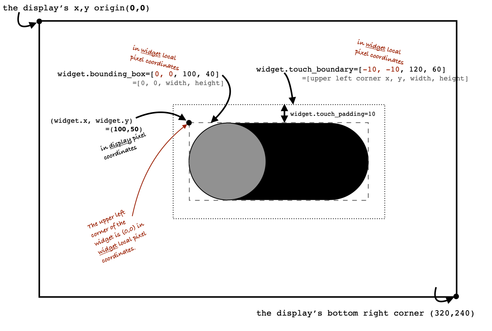

Widget Description
==================

  Diagram showing the global and local coordinate systems and the Widget's
  associated class variables.

Widget Class Positioning: Display vs. Local Coordinates
-------------------------------------------------------

The Widget class is used to define the position and size of the graphical elements
that define the widget.
The Widget is a subclass of `displayio.Group` and inherits the positioning elements
of `displayio.Group`, including *x*, *y* (in pixels).  If the Widget is directly added
to the display, then the *.x* and *.y* positions refer to the pixel position on
the display. (Note: If the Widget is actually held within another Group, then the *.x*
and *.y* of the widget are in that Group's local coordinate system.)

This Widget coordinate system is illustrated in the diagram above, showing the
coordinate systems of a sliding switch widget.  The display's origin (x=0, y=0)
is at the upper left corner of the display.  In this example the display size is
320 x 240 pixels, so the display's bottom right corner is at display coordinates
(x=320, y=240). The upper left corner of the widget is labeled notionally as
*widget.x* and *widget.y* is set at the display pixel position of (x=100, y=50).

Local Coordinates: bounding_box
-------------------------------

Other parameters defined in the Widget class use a "local" coordinate system, as
indicated by the red text in the display.  These include
:const:`bounding_box` and
:const:touch_boundary`  The :const:`bounding_box` defines the origin of a Widget is at the upper
left corner of the key graphical element of the widget and is set to (0,0) in
widget local coordinates.  The :const:`width` and :const:`height` of the :const:`bounding_box` are
defined as the pixel distances that make a minimum box that contains the key
graphical elements of the widget. In the case of this example, the width is
100 pixels and the height is 40 pixels.

.. note::
    If a label is included for a widget, the label should not be
    included in the :const:`bounding_box`

Local Coordinates: touch_boundary (inherited from `Control` class)
--------------------------------------------------------------------

This example of a sliding switch reacts to touch using the addition of
inheritance from the `Control` class, so additional dimensional parameters are
included for that class definition.  Similar to the definition of
the :const:`bounding_box`, the :const:`touch_boundary` is also defined using the widget's
local coordinate system.

As shown in the diagram, we see that the *touch_boundary* is larger than the
:const:`bounding_box`.  The *touch_boundary* should likely be larger than the
:const:`bounding_box` since finger touches are not precise.  The use of additional
space around the widget ensures that the widget reacts when the touch is close
enough.  In the case of this example, the switch widget provides a *touch_padding*
option to define additional space around the :const:`bounding_box` where touches are
accepted (with the `Control.contains()` function).  Looking at the example, we
see that the upper left corner of the *touch_boundary* is (x=-10, y=-10) in widget
local coordinates.  This means that the accepted touch boundary starts at 10 pixels
up and 10 pixels left of the upper left corner of the widget.  The *touch_boundary*
is 120 pixels wide and 60 pixels high.  This confirms that a 10 pixel *touch_padding*
was used, giving additional 10 pixels around the :const:`bounding_box`.  Note: If you are
building your own new widgets, the *touch_boundary* tuple can be adjusted directly to
meet whatever needs your widget needs.  The *touch_boundary* is used in the
`Control.contains()` function to determine when the Control-type widget was touched.

Note: If a widget does not need to respond to touches (for example a display of a
value), then it should not inherit the `Control` class, and thus will not have a
*touch_boundary*.

Positioning on the screen: Using x and y or anchor_point and anchored_position
--------------------------------------------------------------------------------

The Widget class has several options for setting the widget position on the screen.
In the simplest case, you can define the widget's *.x* and *.y* properties to set
the position.  (**Reminder**: If your widget is directly shown by the display using
*display.show(my_widget)*), then the *.x* and *.y* positions will be in the display's
coordinate system.  But if your widget is held inside of another Group, then its
coordinates will be in that Group's coordinate system.)

The Widget class definition also allows for relative positioning on the screen using
the combination of :meth:`~adafruit_displayio_layout.widgets.widget.Widget.anchor_point`
and :meth:`~adafruit_displayio_layout.widgets.widget.Widget.anchored_position`.
This method is useful
when you want your widget to be centered or aligned along one of its edges.

A good example of the use of :const:`anchor_point` and :const:`anchored_position` is in the
`Adafruit "Candy Hearts" learn guide
<https://learn.adafruit.com/circuit-python-tft-gizmo-candy-hearts/how-it-works>`_
related to text positioning.

The :const:`anchor_point` is a Tuple (float, float) that corresponds to the fractional
position of the size of the widget. The upper left corner being
:const:`anchor_point` =(0.0, 0.0) and the lower right corner being :const:`anchor_point` =(1.0, 1.0).
The center of the widget is then :const:`anchor_point` =(0.5, 0.5), halfway along the
x-size and halfway along the y-size.  One more example, the center of the bottom
edge is (0.5, 1.0), halfway along the x-size and all the way of the y-size.

Once you define the :const:`anchor_point`, you can now set the :const:`anchored_position`.  The
:const:`anchored_position` is the pixel dimension location where you want to put the
:const:`anchor_point`.  To learn from example, let's say I want to place my widget so
its bottom right corner is at the bottom right of my display (assume 320 x 240
pixel size display).

First, I want to define the widget reference point to be the bottom right corner of
my widget, so I'll set :const:`anchor_point` =(1.0,1.0).  Next, I want that anchor point
on the widget to be placed at the bottom right corner of my display, so I'll set
:const:`anchored_position` =(320,240).  In essence, the :const:`anchor_point` is defining the
reference ("anchor") point on the widget (but in relative widget-sized dimensions
using x,y floats between 0.0 and 1.0) and then places that :const:`anchor_point` at the
pixel location specified as the :const:`anchored_position` in pixel dimensions
(x, y are in pixel units on the display).

The reason for using :const:`anchor_point` is so that you
don't need to know the width or height of the widget in advance, you can use
:const:`anchor_point` and it will always adjust for the widget's height and width to
set the position at the :const:`anchored_position` pixel position.

In summary:
 - :const:`anchor_point` is x,y tuple (floats) of the relative size of the widget.  Upper left
    corner is (0.0, 0.0) and lower right is (1.0, 1.0).
 - :const:`anchored_position` is in x,y tuple (ints) pixel coordinates where the :const:`anchor_point`
    will be placed.

Switch Round
============

Summary: SwitchRound Features and input variables
---------------------------------------------------

The `SwitchRound` widget has numerous options for controlling its position, visible appearance,
orientation, animation speed and value through a collection of input variables:

    - **position**: ``x``, ``y`` or ``anchor_point`` and ``anchored_position``

    - **size**: ``width`` and ``height`` (recommend to leave ``width`` = None to use
      preferred aspect ratio)

    - **orientation and movement direction (on vs. off)**: ``horizontal`` and ``flip``

    - **switch color**: ``fill_color_off``, ``fill_color_on``, ``outline_color_off`` and
      ``outline_color_on``

    - **background color**: ``background_color_off``, ``background_color_on``,
      ``background_outline_color_off``, and ``background_outline_color_on``

    - **linewidths**: ``switch_stroke`` and ``text_stroke``

    - **0/1 display**: Set ``display_button_text`` = True if you want the 0/1 shapes
      to show on the switch

    - **animation**: Set :attr:`animation_time` to the duration (in seconds) it will take
      to transition the switch, set zero if you want it to snap into position immediately
      (0.2 seconds is a good starting point, and larger values for bigger switches)

    - **value**: Set :attr:`value` to the initial value (True or False)

    - **touch boundaries**: :attr:`touch_padding` defines the number of additional pixels
      surrounding the switch that should respond to a touch.

      .. note:: :attr:`touch_padding` variable updates the :attr:`touch_boundary` Control
          class variable. The definition of the :attr:`touch_boundary` is used to determine
          the region on the Widget that returns `True` in the
          :meth:`~adafruit_displayio_layout.widgets.switch_round.SwitchRound.contains` function.

Description of features
-------------------------

The `SwitchRound` widget is a sliding switch that changes state whenever it is
touched.  The color gradually changes from the off-state color scheme to the
on-state color scheme as the switch transfers from off to the on position.
The switch has an optional display of "0" and "1" on the sliding switch.  The
switch can be oriented using the ``horizontal`` input variable, and the sliding
direction can be changed using the ``flip`` input variable.

Regarding switch sizing, it is recommended to set the height dimension but to
leave the ``width = None``.  Setting ``width = None`` will allow the width to resize
to maintain a recommended aspect ratio of width/height.  Alternately, the switch
can be resized using the ``resize`` command, and it will adjust the width and height
to the maximum size that will fit inside the requested width and height dimensions,
while keeping the preferred aspect ratio.  To make the switch easier to be selected,
additional padding around the switch can be defined using the ``touch_padding`` input
variable to increase the touch-responsive area. The duration of
animation between on/off can be set using the ``animation_time`` input variable.

Internal details: How the SwitchRound widget works
---------------------------------------------------

The `SwitchRound` widget is a graphical element that responds to touch elements
to provide sliding switch on/off behavior.  Whenever touched, the switch toggles
to its alternate value. The following sections describe the construction of the
`SwitchRound` widget, in the hopes that it will serve as a first example of the key
properties and responses for widgets.

The `SwitchRound` widget inherits from two classes, it is a subclass of `Widget` (which
itself is a subclass of `displayio.Group`) and a subclass of `Control`.  The `Widget`
class helps define the positioning and sizing of the switch, while the `Control` class
helps define the touch-response behavior.

The following several sections describe the structure and inner workings of `SwitchRound`.

Group structure: Display elements that make up SwitchRound
-------------------------------------------------------------

The `Widget` class is a subclass of `displayio.Group`, thus we can append graphical
elements to the Widget for displaying on the screen.  The switch consists of the
following graphical elements:

0. switch_roundrect: The switch background
1. switch_circle: The switch button that slides back and forth
2. Optional: text_0: The "0" circle shape on the switch button
3. Optional: text_1: The "1" rectangle shape on the switch button

The optional text items can be displayed or hidden using the :attr:`display_button_text`
input variable.

Coordinate systems and use of anchor_point and anchored_position
-----------------------------------------------------------------

See the `Widget` class definition for clarification on the methods for positioning
the switch, including the difference in the display coordinate system and the Widget's
local coordinate system.

The Widget construction sequence
----------------------------------

Here is the set of steps used to define this sliding switch widget.

1. Initialize the stationary display items
2. Initialize the moving display elements
3. Store initial position of the moving display elements
4. Define "keyframes" to determine the translation vector
5. Define the ``_draw_position`` function between 0.0 to 1.0 (and slightly beyond)
6. Select the motion "easing" function
7. **Extra**. Go check out the ``_animate_switch`` method

First, the stationary background rounded rectangle (RoundRect is created).  Second,
the moving display elements are created, the circle for the switch, the circle for
the text "0" and the rectangle for the text "1". Note that either the "0" or "1" is
set as hidden, depending upon the switch value.  Third, we store away the
initial position of the three moving elements, these initial values will be used in the
functions that move these display elements.  Next, we define the motion of the
moving element, by setting the ``self._x_motion`` and ``self._y_motion`` values
that depending upon the ``horizontal`` and ``flip`` variables. These motion variables
set the two "keyframes" for the moving elements, basically the endpoints of the switch
motion.  (Note: other widgets may need an ``_angle_motion`` variable if they require
some form of rotation.)  Next, we define the ``_draw_function`` method.  This method
takes an input between 0.0 and 1.0 and adjusts the position relative to the motion
variables, where 0.0 is the initial position and 1.0 represents the final position
(as defined by the ``_x_motion`` and ``_y_motion`` values).  In the case of the
sliding switch, we also use this ``position`` value (0.0 to 1.0) to gradually
grade the color of the components between their "on" and "off" colors.

Making it move
----------------

Everything above has set the ground rules for motion, but doesn't cause it to move.
However, you have set almost all the pieces in place to respond to requests to change
the position.  All that is left is the **Extra** method that performs the animation,
called ``_animate_switch``. The ``_animate_switch`` method is triggered by a touch
event through the ``selected`` Control class method.  Once triggered, this method
checks how much time has elapsed.  Based on the elapsed time and the ``animation_time``
input variable, the ``_animate_switch`` function calculates the ``position`` where
the switch should be.  Then, it takes this ``position`` to call the ``_draw_position``
method that will update the display elements based on the requested position.

But there's even one more trick to the animation.  The ``_animate_switch`` calculates
the target position based on a linear relationship between the time and the position.
However, to give the animation a better "feel", it is desirable to tweak the motion
function depending upon how this widget should behave or what suits your fancy. To
do this we can use an "easing" function.  In short, this adjusts the constant speed
(linear) movement to a variable speed during the movement.  Said another way, it
changes the position versus time function according to a specific waveform equation.
There are a lot of different "easing" functions that folks have used or you can make
up your own.  Some common easing functions are provided in the ``easing.py`` file.
You can change the easing function based on changing which function is imported
at the top of this file. You can see where the position is tweaked by the easing
function in the line in the ``_animate_switch`` method:

.. code-block:: python3

    self._draw_position(easing(position))  # update the switch position

Go play around with the different easing functions and observe how the motion
behavior changes.  You can use these functions in multiple dimensions to get all
varieties of behavior that you can take advantage of.  The website
`easings.net <https://easings.net>`_ can help you
visualize some of the behavior of the easing functions.

.. note:: Some of the "springy" easing functions require position values
        slightly below 0.0 and slightly above 1.0, so if you want to use these, be sure
        to check that your ``_draw_position`` method behaves itself for that range
        of position inputs.

Orientation and a peculiarity of width and height definitions for SwitchRound
-------------------------------------------------------------------------------

In setting the switch sizing, use height and width to set the narrow and wide
dimension of the switch.  To try and reduce confusion, the orientation is modified
after the height and width are selected.  That is, if the switch is set to vertical,
the height and still mean the "narrow" and the width will still mean the dimensions
in the direction of the sliding.

If you need the switch to fit within a specific bounding box, it's preferred to use
the ``resize`` function.  This will put the switch (in whatever orientation) at the
maximum size where it can fit within the bounding box that you specified.  The switch
aspect ratio will remain at the "preferred" aspect ratio of of 2:1 (width to height)
after the resizing.

Setting the touch response boundary
-----------------------------------

The touch response area is defined by the Control class variable called
``touch_boundary``. In the case of the `SwitchRound` widget, we provide an
``touch_padding`` input variable.  The use of ``touch_padding`` defines an
additional number of pixels surrounding the display elements that respond to touch
events.  To achieve this additional space, the ``touch_boundary`` increases in size
in all dimensions by the number of pixels specified in the ``touch_padding`` parameter.

The ``touch_boundary`` is used in the Control function ``contains`` that checks
whether any touch_points are within the boundary. Please pay particular attention to
the `SwitchRound` contains function, since it calls the `Control.contains` superclass
function with the touch_point value adjusted for the switch's ``.x`` and ``.y`` values.
This offset adjustment is required since the `Control.contains` function operates only
on the widget's local coordinate system.  It's good to keep in mind which coordinate
system you are working in, to ensure your code responds to the right inputs!

Summary
--------

The `SwitchRound` widget is an example to explain the use of the `Widget` and `Control`
class functions.  The `Widget` class handles the overall sizing and positioning function
and is the group that holds all the graphical elements.  The `Control` class is used to
define the response of the widget to touch events (or could be generalized to other
inputs).  Anything that only displays (such as a graph or an indicator light) won't
need to inherit the `Control` class.  But anything that responds to touch inputs should
inherit the `Control` class to define the ``touch_boundary`` and the touch response
functions.

I hope this `SwitchRound` widget will help turn on some new ideas and highlight some
of the new capabilities of the `Widget` and `Control` classes.  Now go see what else
you can create and extend from here!

A Final Word
---------------

The design of the Widget and Control classes are open for inputs.  If you think
a additions or changes are useful, add it and please submit a pull request so
others can use it too!  Also, keep in mind you don't even need to follow these classes
to get the job done.  The Widget and Class definitions are designed to give guidance
about one way to make things work, and to try to share some code.  If it's standing in
your way, do something else!  If you want to use the ``grid_layout`` or other layout tools
in this library, you only *really* need to have methods for positioning and resizing.

.. note:: **Never let any of these class definitions hold you back, let your imagination run
    wild and make some cool widgets!**
